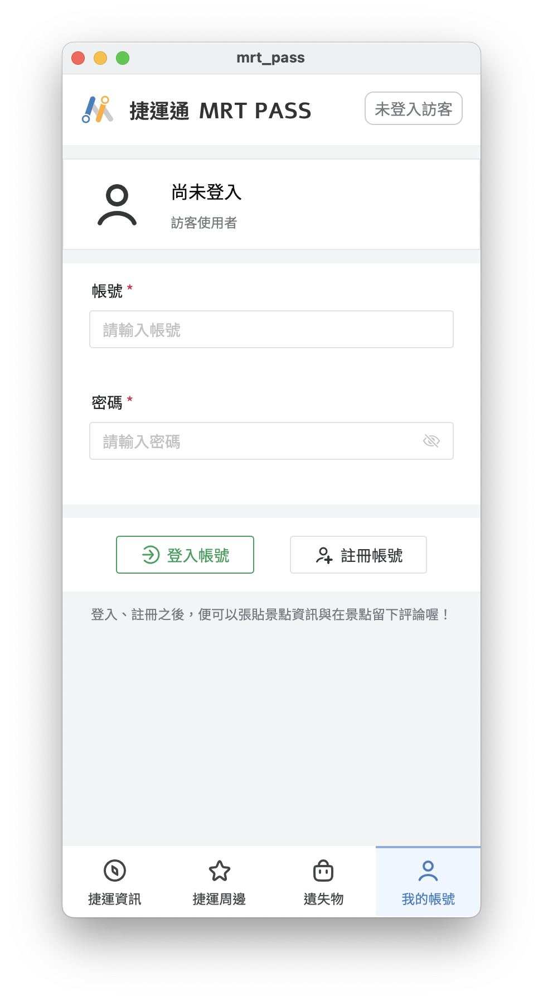

# 程式安裝說明

> 請按照下列指示步驟進行安裝

## 一、前端應用程式安裝

1. Mac OS
    - 請點擊連結前往下載 [MRTPass_arm64.dmg](https://drive.google.com/file/d/1qs6XvVPgfjRIE-02ey2zuJ0l2_vGy0SN/view) 的  `.dmg` 安裝檔
    - 下載完成後，雙擊 `.dmg` 檔案，並將 `MRTPass.app` 拖曳至 `Application` 資料夾中
    - 點擊 `MRTPass.app` 應用程式，便可以啟動應用程式

2. Windows
    - 請點擊連結前往下載 [MRTPass.exe](https://drive.google.com/file/d/1r13PKm2uK-uLbJ19ZO1xuyfcrvF-WlxL/view?usp=sharing) 的 `.exe` 安裝檔
    - 下載完成後，雙擊 `.exe` 檔案，便可以啟動應用程式

> Linux 系統暫時不支援（請靜候 v2.0 版本 release）

## 二、後端應用程式安裝

> 請注意，前後端皆是必要安裝的，前端是介面、後端有資料庫缺一不可

後端環境須先安裝 `docker`，請參考 [docker 安裝教學](https://docs.docker.com/engine/install/)，安裝完成後，再進行下列步驟

1. 使用 `git clone` 指令將專案下載至本機

    ```bash
    git clone https://github.com/Flyingdolar/MRTPass.git
    ```

2. 進入專案資料夾，再進入 `backend` 資料夾

    ```bash
    cd MRTPass/backend
    ```

3. 使用 `docker` 指令安裝後端環境

    ```bash
    docker build -t mydocker .
    docker run -p 3000:3000 mydocker
    ```

4. 開啟前端的應用程式，即可開始使用啦！


