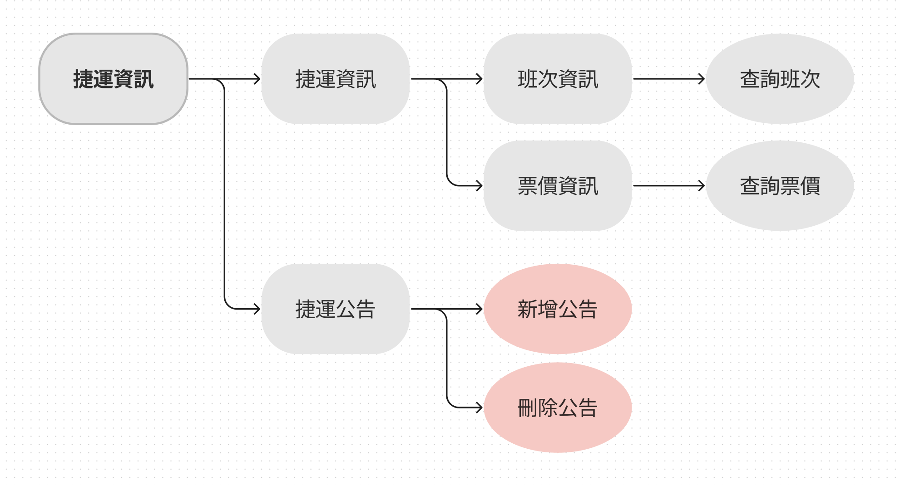
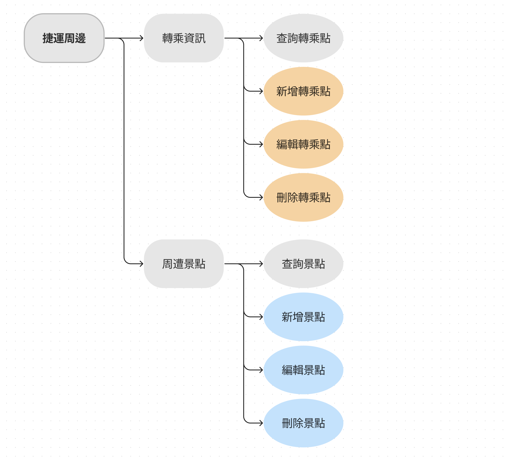
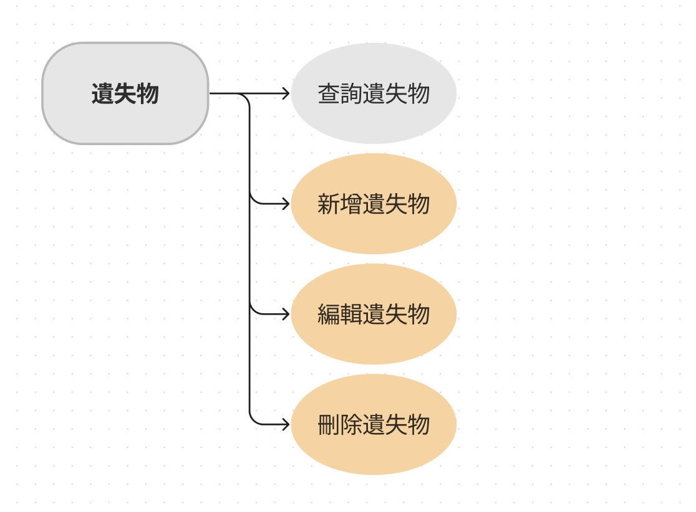
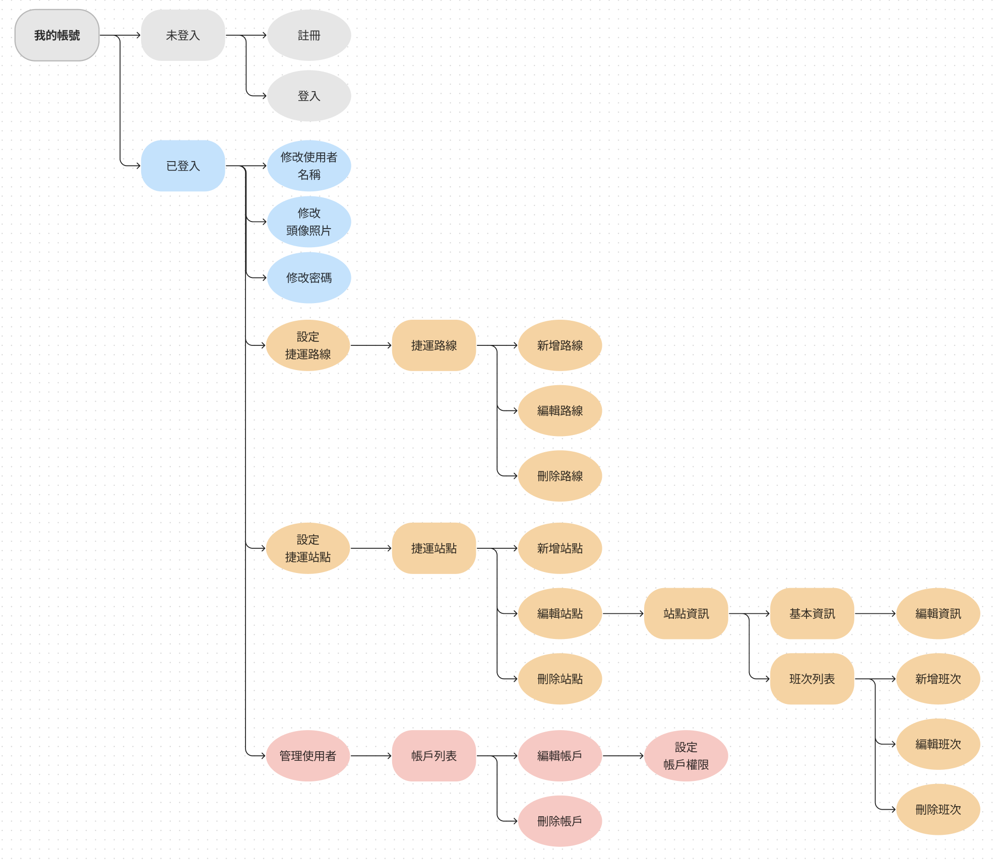

# 捷運通 MRT Pass

> 2023 Spring 資料庫理論 - Group 5 期末專題

## 下載專區

> 請點擊我到下載說明頁面！

## 一、內容簡介

本系統為一個捷運管理系統，旨在提供使用者一個方便、快速、精確的查詢、管理捷運資訊的平台。使用者包括系統管理者、會員和一般民眾。

系統管理者可透過登入系統，進行使用者管理，包括新增、減少、調整捷運資訊，張貼捷運營運公告，以及張貼或尋找遺失物等功能。此外，系統管理者也可新增周邊資訊，例如公車轉運等，以提供使用者更多選擇。

會員可以透過登入系統，新增周邊資訊，例如娛樂、飲食等，並對周邊進行評論留言，以便其他使用者參考。

一般民眾可以在未登入的情況下，透過本系統查詢捷運班次、票價、轉乘站點等資訊，並且查看周邊資訊，例如娛樂、飲食、公車轉運等，以及失物招領資訊等。

總體而言，本系統提供了一個完整的捷運資訊管理平台，方便不同類型的使用者查詢、管理相關資訊，進而提高使用效率和便利性。

## 二、系統需求分析

本軟體經由使用者分析，歸納出使用捷運資訊系統的主要為三種類型之使用者。並針對個別類型使用者分析其需求、並進行功能之開發：

| 系統管理者 | 捷運管理方面 | 會員（登入） | 一般民眾（未登入） |
|:------:|:----------:|:--------:|:------------:|
| 使用者管理 | 登入系統（管理捷運系統） | 新增周邊資訊(娛樂、飲食) | 查詢班次 |
| 所有其他權限使用者可使用之功能 | 新增、減少、調整捷運資訊 | 對周邊進行評論(留言) | 票價查詢 |
| | 張貼捷運營運公告 | 尋找遺失物 | 查詢轉乘站點 |
| | 張貼或尋找遺失物 | 所有一般民眾可使用之功能 | 查看周邊(娛樂、飲食、公車轉運) |
| | 新增周邊資訊(公車轉運) | | 查看失物招領資訊 |
| | 所有會員、一般民眾可使用之功能 | | |

## 三、系統架構與功能

系統架構上主要分為四大系統：

* 捷運系統
* 登入系統
* 遺失物
* 周邊景點

依照使用者層級能夠取得系統內的不同功能
（上層使用者能夠取得所有下層使用者能使用功能）

## 四、資料主體分析

> 總共有 9 個 Entity 作為資料主體

| 會員          |  捷運站點   | 周邊資訊   | 周邊資訊評論 |
|:------:      |:----------:|:--------:|:------------:|
|   ID         |  線顏色      |    ID    |     ID       |
|  帳號(email)  |  站點編號    |   名稱    |   發布時間    |
|  密碼         |  站點經度    |   照片    |    照片      |
|  暱稱         |  站點緯度    |   地址    |    評論      |
|  帳號權限     |  線數(1or2) |  平均評分  |    評論者     |
|  大頭照       |   出口數    |    描述   |     評分      |

| 捷運班次  |   遺失物   |  票價表    | 公告      |
|:--------:|:---------:|:---------:|:--------:|
|    ID    |     ID    |  距離上界  |    ID     |
|  開車時間 |  物品描述   |  距離下界  |   主題    |
|  線顏色   |    照片    |   價格    |   內文    |
|  終點站   |    時間    |          |    時間   |
|          | (遺失)位置  |          |          |
|          |  遺失屬性   |          |          |

## 五、開發環境與軟體

1. 前端：`Vue + Electron`

2. 後端：`Raiils on Ruby`

3. 資料庫：`SQL lite`

## 六、設計圖說明

> 設計圖的說明(entity set, relationship set, attribute 的含意,並討論不同設計的可能性,解釋採用此設計的理由)

### 實體集（Entity Set）

1. **會員(Member)**：代表使用者在系統中的註冊帳號，包含會員ID、姓名、電子郵件、密碼等屬性。
2. **捷運站點(Station)**：代表捷運系統中的車站，包含站點ID、站點名稱、經緯度、地址等屬性。
3. **周邊資訊(Information)**：代表捷運站點周邊的景點、商家等資訊，包含景點ID、景點名稱、景點種類、地址、描述等屬性。
4. **周邊資訊評論(Comment)**：代表會員對周邊資訊所做的評論，包含評論ID、評論內容、評分、時間等屬性。
5. **捷運班次(Time)**：代表捷運站點所屬的班次時刻表，包含班次ID、開始時間、結束時間、星期幾等屬性。
6. **遺失物(Lost)**：代表會員在捷運站點遺失的物品，包含物品ID、物品名稱、遺失時間、描述等屬性。
7. **票價表(Ticket)**：代表捷運系統中各站之間的票價，包含起訖站、票價等屬性。
8. **公告(Announcement)**：代表捷運系統所發布的公告，包含公告ID、標題、內容、時間等屬性。

### 關係集（Relation Set）

* **會員-遺失物**：一個會員可以有0~多個遺失物，但一個遺失物只能屬於一個會員。這個關係表示會員可以報告他們遺失的物品，讓系統能夠追蹤和管理這些遺失物。

* **會員-公告**：一個會員(捷運管理員)可以發佈0~多個公告，但一個公告只能屬於一個會員。這個關係表示會員可以發佈和管理他們的公告。

* **會員-評論**：一個會員可以發佈0~多個評論，但一個評論只能屬於一個會員。這個關係表示會員可以對周邊的景點進行評論，讓其他會員能夠參考。

* **評論-景點**：一個景點可以有0~多個評論，但一個評論只能屬於一個景點。這個關係表示一個景點可以被多個會員評論，並且這些評論可以被其他會員參考。

* **站點-景點**：一個站點可以有0~多個景點，一個景點也可以屬於1~多個站點。這個關係表示一個站點可以擁有多個周邊景點，而一個景點也可以在多個站點附近。

* **班次表-站點**：一個站點能對應到多個班次表，但一個班次表只可以對應到一個站點。

* **站點-站點**：一個站點為兩個線的交叉點，因此用來記錄同站點的兩個編號 如古亭有G09及O05

設計上主要以站點（Station）為核心搜尋，可以以站點（Station）檢索、新增附近景點資訊（Information），亦可以透過站點（Station）取得到站的列車資訊。
由於附近景點資訊（Information）可能同處於作為多個站點的附近資訊（距離多個站點附近），故採用多對多的方式作為關聯。

另外在會員使用者（Member）上，可以針對附近景點（Information）張貼發布對應的遺失物（Lost）、評論（Comment）。而每個遺失物、評論能找到對應的發布使用者（Member）、評論能指向唯一的附近景點（Information），以此方便做管理與檢索。

## 七、系統功能與流程圖

本軟體主要分為以下四種功能，以下將進行逐一介紹：

1. 捷運資訊
2. 周邊景點
3. 遺失物
4. 帳號管理

而在流程圖上，不同圖案、顏色有各自的意義：

| 圖案 | 意義 |
| -------- | -------- |
| 長方形 | 頁面 |
| 圓形 | 功能 |

| 顏色 | 意義 |
| -------- | -------- |
| 灰色 | 所有使用者皆可取用之功能 |
| 藍色 | 登入之會員可取用之功能 |
| 橘色 | 捷運方面之管理員可取用之功能 |
| 紅色 | 系統管理員可取用之功能 |

### 1. 捷運資訊

主要有捷運資訊、捷運公告兩個頁面組成，使用者可透過查詢班次、查詢票價功能取得相關資訊，並且可以透過捷運公告查看最新的捷運公告。

而在管理方面上，管理員可以在捷運公告頁面上進行公告的新增、修改、刪除等操作。

### 2. 周邊景點

主要分為轉乘資訊、周邊景點兩個頁面，使用者可以透過轉乘資訊查詢兩個站點之間的轉乘資訊，並且可以透過周邊景點查看附近的景點資訊。

如果是會員使用者，可以進行景點資訊的新增、修改、刪除等操作。

若是捷運方面的管理員，可以進行轉乘資訊的新增、修改、刪除等操作。

### 3. 遺失物

遺失物所有使用者皆可進行查詢的動作

而遺失物的新增、刪除、修改等操作則是由捷運方面的管理員進行

### 4. 我的帳號

針對未登入之訪客使用者，可以進行註冊、登入等操作

而登入之會員使用者，可以進行登出、修改帳戶名稱、頭像、密碼等操作

而捷運方面的管理員，可以進行捷運路線的設定、以及站點、站點班次資訊的新增、修改、刪除等操作

最後系統管理員可以進行帳號的刪除、修改、改變權限等操作

---

## 開發成員

> 40747018S 曾皓群
> 40768033T 鄭翔元
> 40841219S 葉威佑
> 40841202S 楊焜華
